# Girls in ICT Day Dominica 2019

This year, we are bulding a robot based on the [Otto DIY kit](https://www.ottodiy.com/). Today we will write simple programs to learn how each part can be controlled. Then we will fit everything together to make a complete system that walks. If we have time, we will even have a dance competition!

##I. Parts

Here are the building blocks of our robot:

### The brain
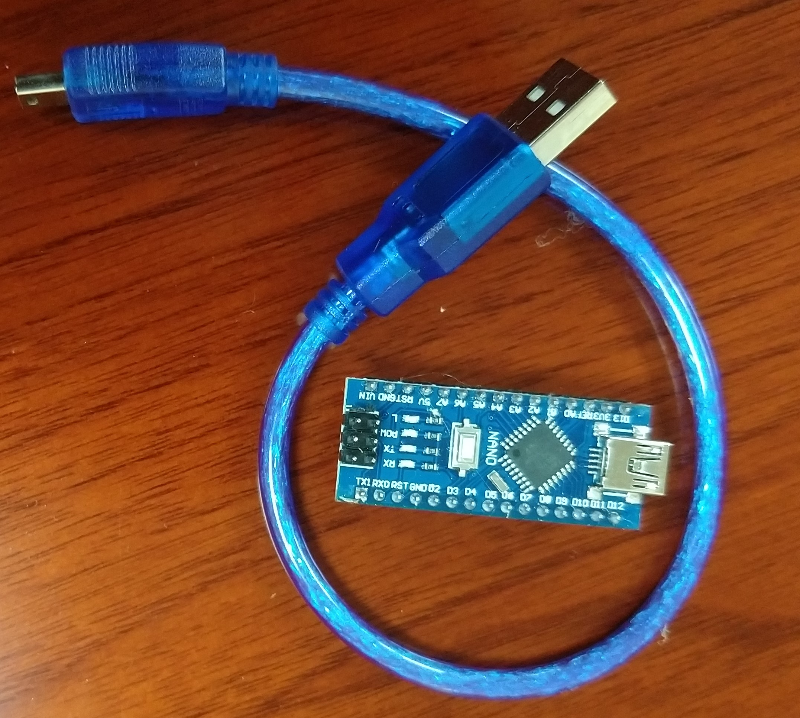

This is a microcontroller, which will be used to give commands to the robot. You can think of a microcontroller as a very simple computer. For comparison, a smartphone is more than 100x faster than this microcontroller! However, it is more than powerful enough to make our robot walk and dance. This particular microcontroller is called an Arduino Nano. [You can find out more about it here](https://store.arduino.cc/usa/arduino-nano).

In order to control our robot, we will need to write a software program and send it to the Arduino. We use a program called an IDE (integrated development environment) to do this. We will download and install the IDE after we introduce all the main parts.

### The nervous system
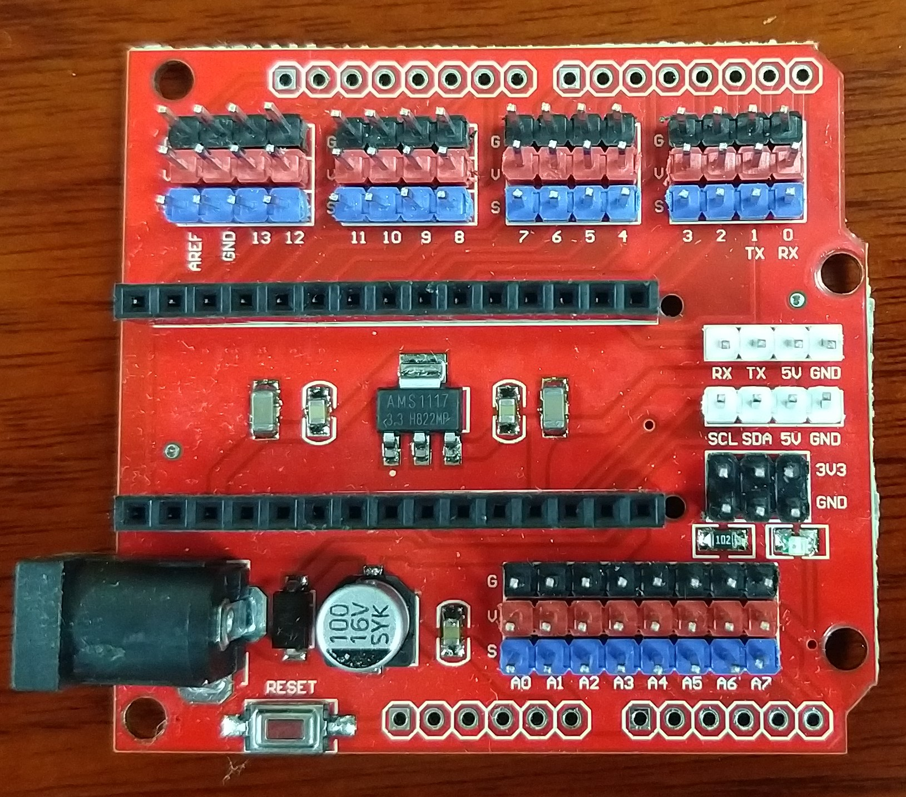

This is an add-on board for our Arduino Nano microcontroller, which makes it easier to connect other parts to the brain, similar to how our nervous system connects our muscles and sensory organs to our brains. This add-on board makes it easier to connect motors to make our robot move, and sensors to let our robot gather information about its surroundings.

### The muscles
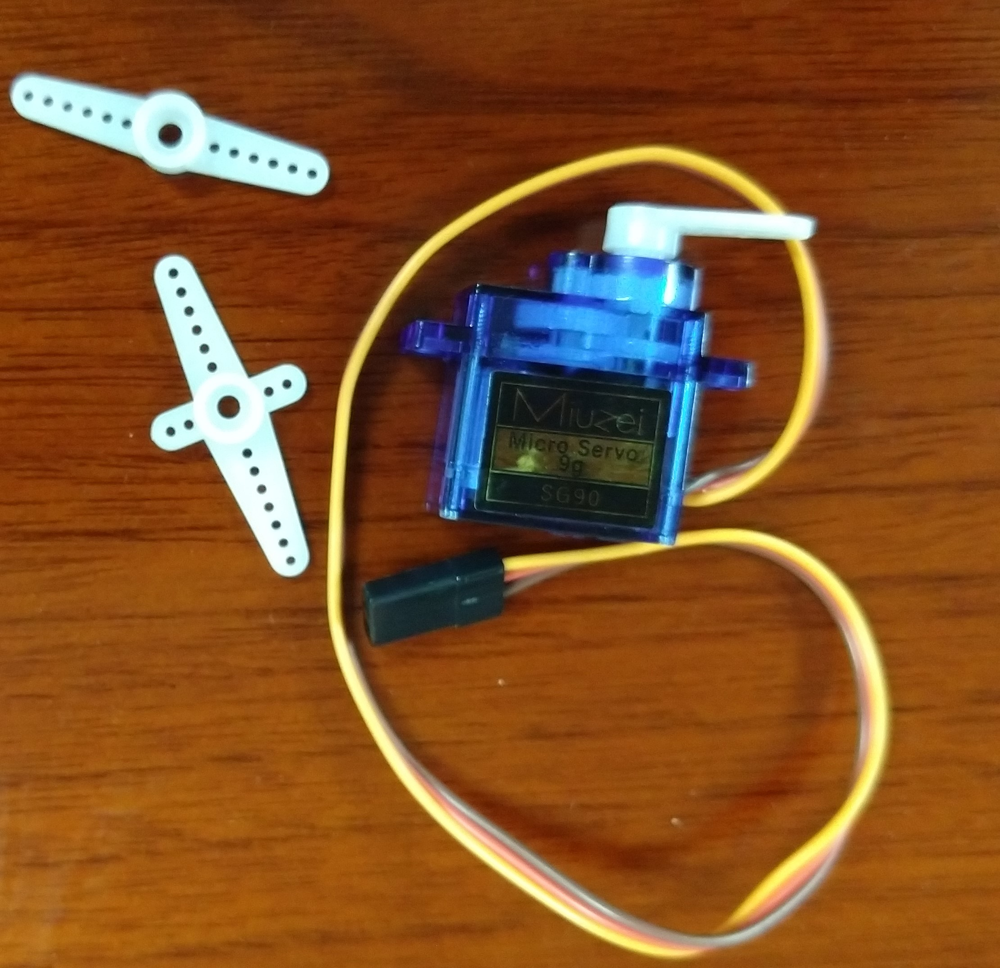

This is a type of motor called a rotary servomotor. By controlling these, we can move our robot's body, similar to the way our muscles move our bodies. It has three wires: two are for power, and one is for sending special signals to control the motor. This motor can rotate to specific angles, based on the signals sent to it.

### The eyes/ears
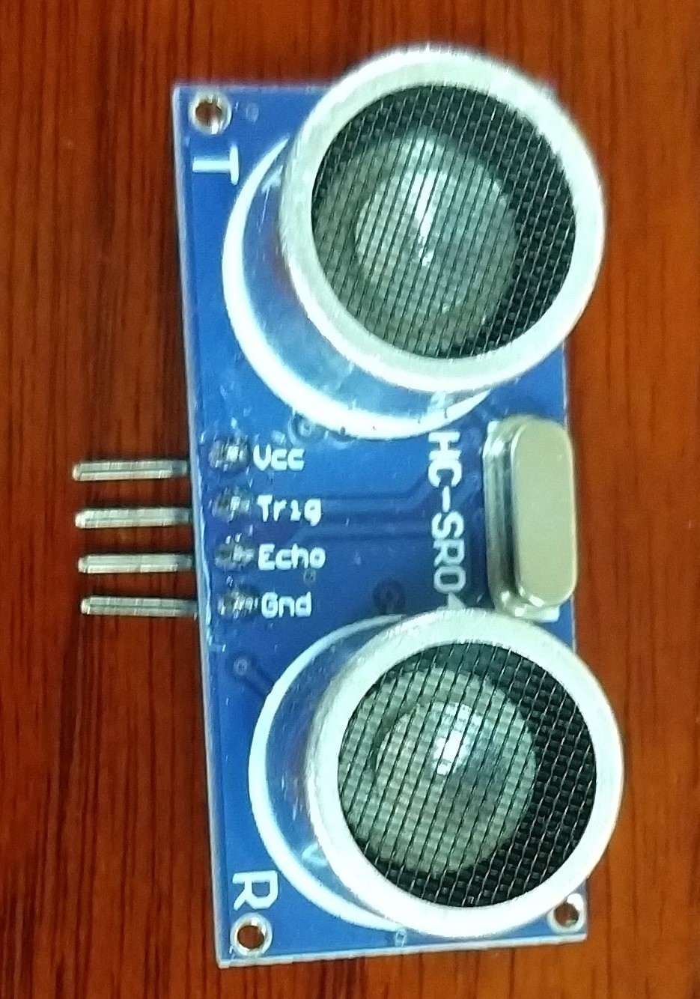

This is a distance sensor. It sends out ultrasonic sound waves from one side, then listens for echoes on the other side. Based on the time taken for the echo to arrive, it can estimate the distance to walls and other large objects in front of it. We will use this to make sure our robot does not keep walking when it gets to a wall.

### The skeleton
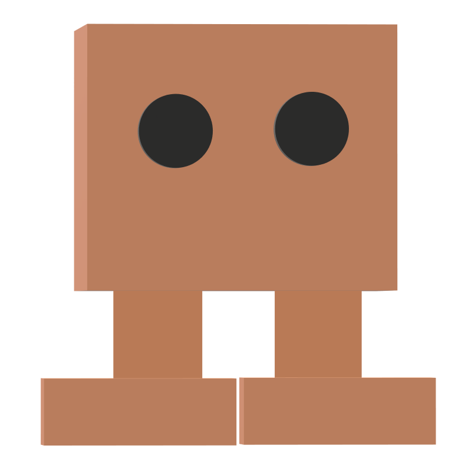

Finally, we will build a cardboard body to hold all the parts together and make our robot move. The robot is made up of a head, legs, and feet.

## II. Getting Ready

### Software setup

To control our robot, we must be able to program the Arduino Nano microcontroller. First, we need to [download the IDE from here](https://www.arduino.cc/en/Main/Software). Download the zip file for 'non-admin install'. Extract it somewhere and double click on the Arduino.exe file. You will see something like the image below:

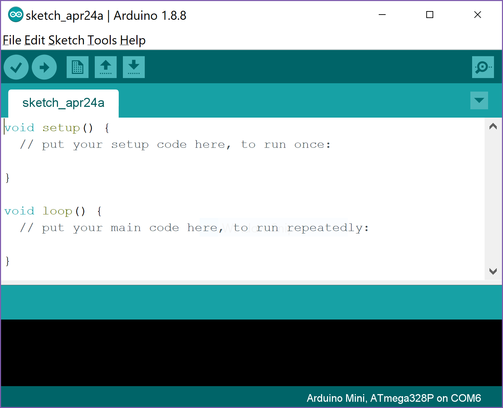

Then, plug one end of the USB cord into your Arduino Nano, and the other end to your computer. Red lights should turn on on the Arduino, showing that it is receiving power from the computer. Now we need to make sure the IDE knows what type of microcontroller we are using. Go to the Tools menu and look for the "Board" option. Select "Arduino Nano" from the list.

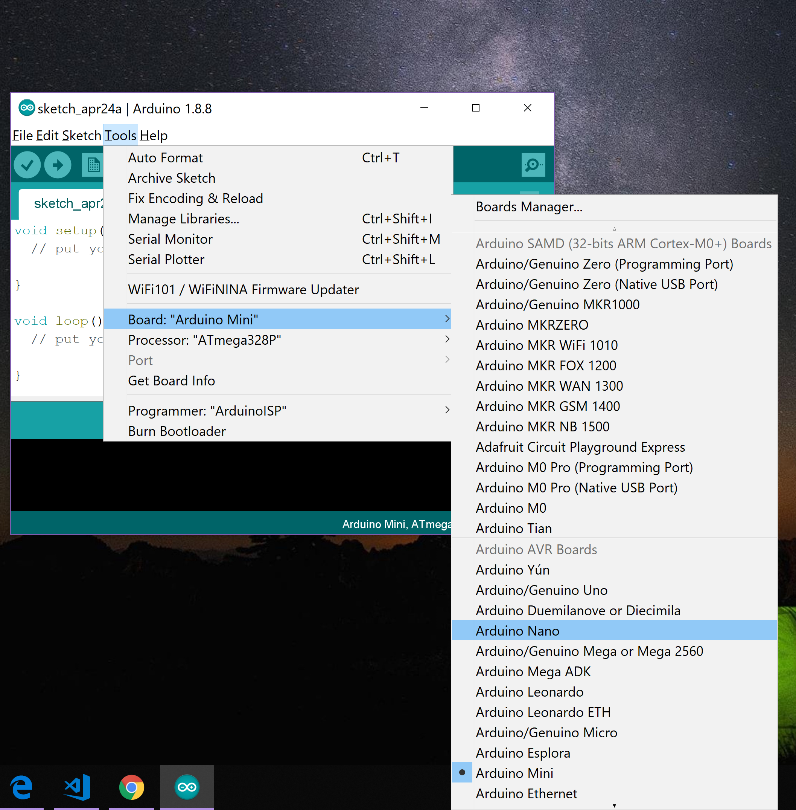

The boards we are using today need an additional step. Go to the Tools menu again, and change the "Processor" option to use the old bootloader.

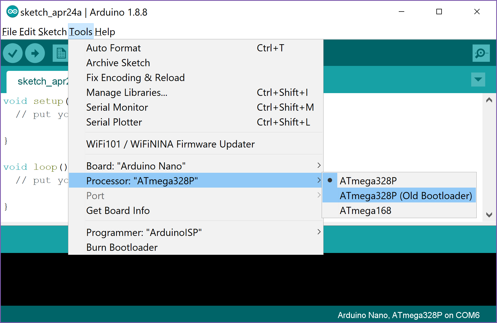

Now we can send code to the Arduino. Before we continue, we will plug the Arduino into the socket on the driver board. Make sure to plug it in the correct way.

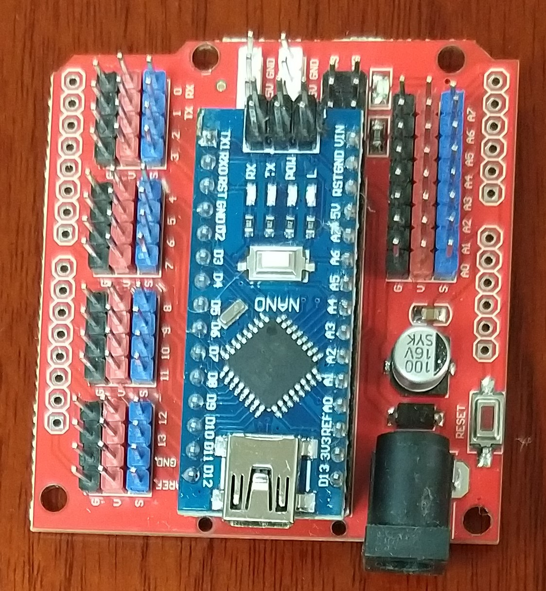

Finally, we need to download the [Otto DIY libraries from Github](https://github.com/OttoDIY/DIY). Click on the green button that says "Clone or download" then choose "Download ZIP".

### Hardware setup

For our first examples, we will use a single motor and the distance sensor. The driver board contains many rows of three pins on each side. Each row contains black, red and blue pins. The black and red pins are called ground and power, respectively, and provide electric power to the components we want to attach. Each blue pin is connected to one of the pins on our Arduino Nano, so that signals can be transferred back and forth between the attached component and the microcontroller.

Unplug the Arduino from the USB cable, so that no power is flowing through it.

First, we will attach the servomotor. Look for the row of pins next to the number 2, and plug the motor wires into this row. Make sure that the brown wire is connected to the black pin (ground); that way, the other two pins will also be correctly attached. Then, take one of the plastic arms included with the motor and snap it on to the axle. This will let us see the rotation more clearly. Your connection should look like the image below.

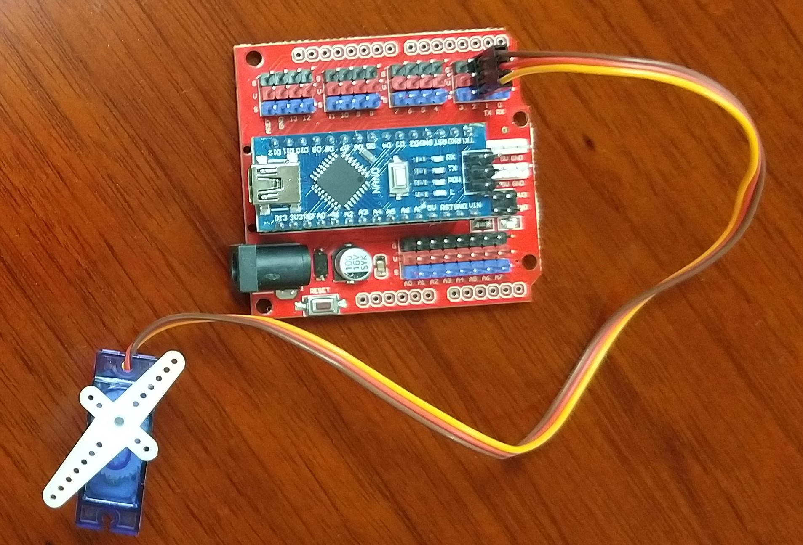

Next, we attach the distance sensor. Take the bundle of 4 wires that is included with the sensor, and connect them so that the brown wire is attached to GND, and the yellow wire is attached to VCC. Using brown for ground keeps this sensor consistent with the motors, so we can easily see when something is connected incorrectly. Now we will connect the other end to the driver board. Connect the orange wire, TRIG, to blue pin 8, and connect the red wire, ECHO, to blue pin 9. Then connect the brown wire, GND, to any nearby black pin, and the yellow wire, VCC, to any nearby red pin. Check the image below to make sure you have connected everything correctly.

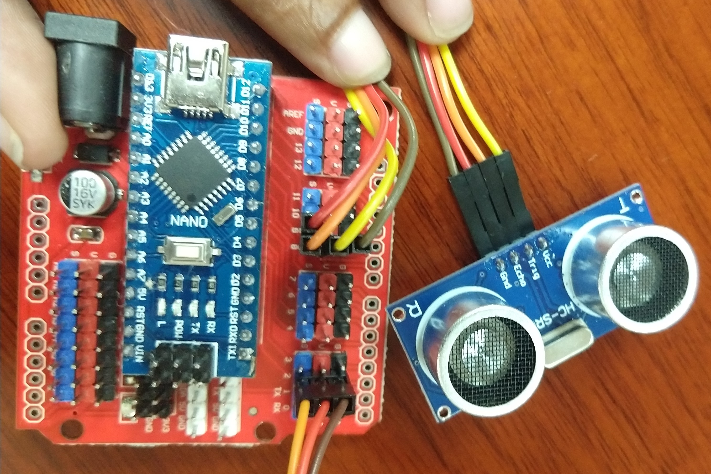

Now you are ready to try out some simple robotics exercises.

## III. Introduction to Robotics

The first thing we will do is control the 

# IV. Putting It All Together

## V. Libraries Make Life Easier

## VI. Dance Competition

